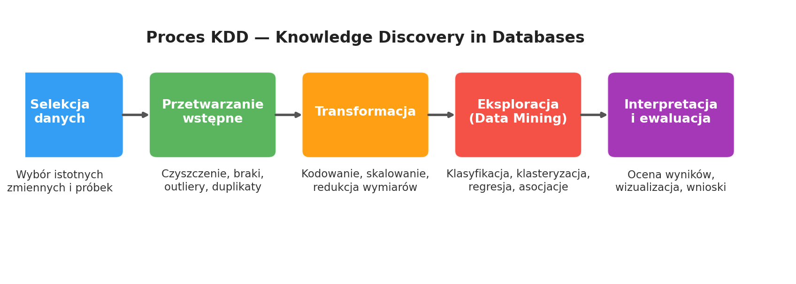
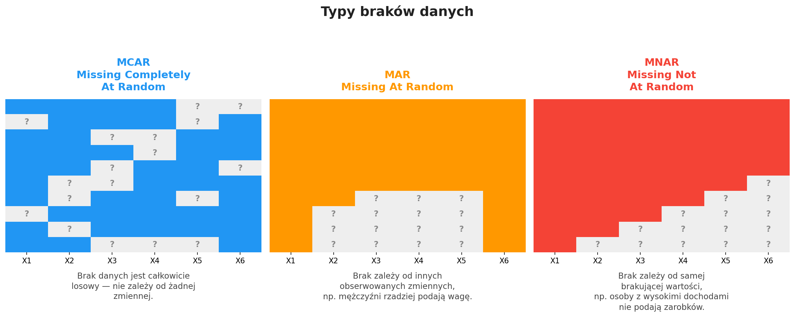
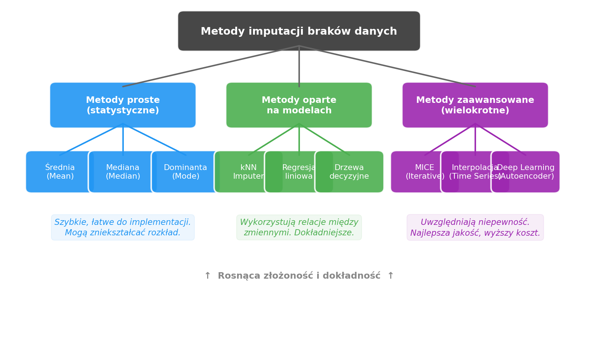

# Laboratorium 1: Proces KDD i przetwarzanie wstępne danych
### Zaawansowana Eksploracja Danych

**Cel laboratorium:** Zrozumienie procesu odkrywania wiedzy z danych (KDD) oraz praktyczne opanowanie technik czyszczenia, imputacji i transformacji danych na przykładzie zbioru Titanic.

---

## Dlaczego przetwarzanie danych jest kluczowe?

- **„Garbage in — garbage out"** — nawet najlepszy model da złe wyniki, jeśli zostanie wytrenowany na niskiej jakości danych.
- Szacuje się, że **60–80% czasu** w projektach Data Science poświęcane jest na przygotowanie danych, a nie na samo modelowanie.
- Typowe problemy w danych rzeczywistych:
  - **Braki danych** — np. brak informacji o wieku pasażerów w zbiorze Titanic.
  - **Wartości odstające** — ekstremalnie wysokie ceny biletów zniekształcające statystyki.
  - **Duplikaty i niespójności** — różne formaty dat, niespójne kategorie.
- Dobrze przeprowadzone przetwarzanie wstępne może poprawić jakość modelu o **10–30%** bez zmiany algorytmu.

---

## Proces KDD — Knowledge Discovery in Databases

- **Selekcja** — wybieramy zmienne istotne dla problemu (np. `age`, `pclass`, `sex` do predykcji przeżycia).
- **Przetwarzanie wstępne** — identyfikacja braków (`isnull()`), duplikatów, typów danych; czyszczenie zbioru.
- **Transformacja** — kodowanie zmiennych kategorycznych (One-Hot, Label Encoding), skalowanie (standaryzacja, normalizacja), dyskretyzacja.
- **Eksploracja (Data Mining)** — stosowanie algorytmów uczenia maszynowego: klasyfikacja, klasteryzacja, regresja, reguły asocjacyjne.
- **Interpretacja i ewaluacja** — ocena jakości wyników, wizualizacja, walidacja krzyżowa, wnioski biznesowe.

---

## Problemy z jakością danych

- **MCAR** (Missing Completely At Random) — brak jest w pełni losowy, nie zależy od żadnej zmiennej. Bezpieczne usunięcie wierszy.
- **MAR** (Missing At Random) — brak zależy od innych obserwowanych zmiennych (np. mężczyźni rzadziej podają wagę). Wymaga imputacji warunkowej.
- **MNAR** (Missing Not At Random) — brak zależy od samej brakującej wartości (np. osoby z wysokimi dochodami unikają podawania zarobków). Najtrudniejszy do obsługi.
- Oprócz braków, dane mogą zawierać: **wartości odstające** (metoda IQR), **duplikaty** (`drop_duplicates()`), **niespójne typy** i **szum**.

---

## Techniki imputacji i czyszczenia

- **Metody proste** — zastąpienie braków średnią, medianą lub dominantą. Szybkie, ale mogą zaniżać wariancję.
- **Metody oparte na modelach** — kNN Imputer (podobni sąsiedzi), regresja liniowa, drzewa decyzyjne. Lepiej oddają relacje między zmiennymi.
- **Metody zaawansowane** — MICE (wielokrotna imputacja łańcuchowa), interpolacja dla szeregów czasowych, autoenkodery. Najwyższa jakość, ale wyższy koszt obliczeniowy.
- W laboratorium stosujemy: **medianę w grupach** (`age` wg `pclass`), **dominantę** (`embarked`), **usunięcie kolumny** (`deck` przy >50% braków) oraz **metodę IQR** do outlierów.

---

## Podsumowanie

Po ukończeniu tego laboratorium powinieneś umieć:

- ✅ **Opisać 5 etapów procesu KDD** i wskazać, na którym etapie stosujemy poszczególne techniki.
- ✅ **Zidentyfikować typy braków danych** (MCAR / MAR / MNAR) i dobrać odpowiednią strategię obsługi.
- ✅ **Zastosować techniki imputacji** — od prostych (mediana, dominanta) po zaawansowane (kNN, MICE).
- ✅ **Przeprowadzić kodowanie zmiennych** kategorycznych (Label Encoding, One-Hot) i skalowanie (StandardScaler, MinMaxScaler).
- ✅ **Zintegrować dane z wielu źródeł** za pomocą operacji `merge`/`join` i obsłużyć powstałe braki.

**Zadanie domowe:** Pełny preprocessing zbioru *Adult Income* (UCI) — od identyfikacji braków po raport z transformacji.
