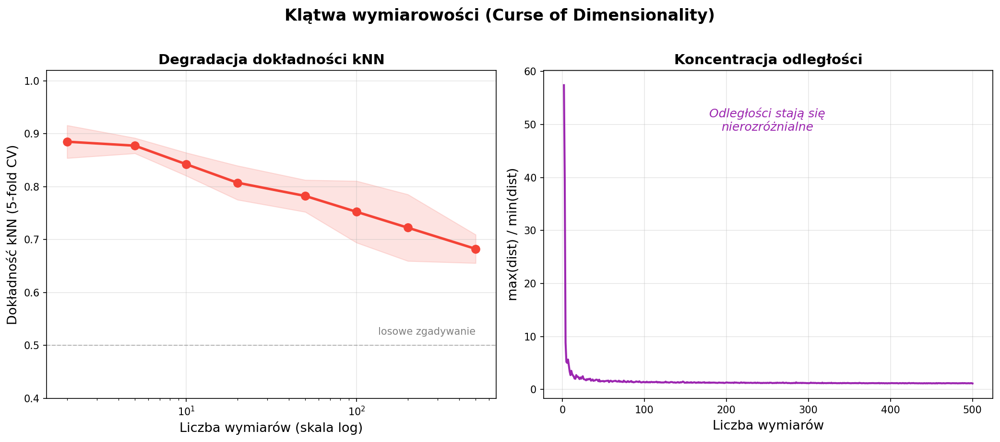
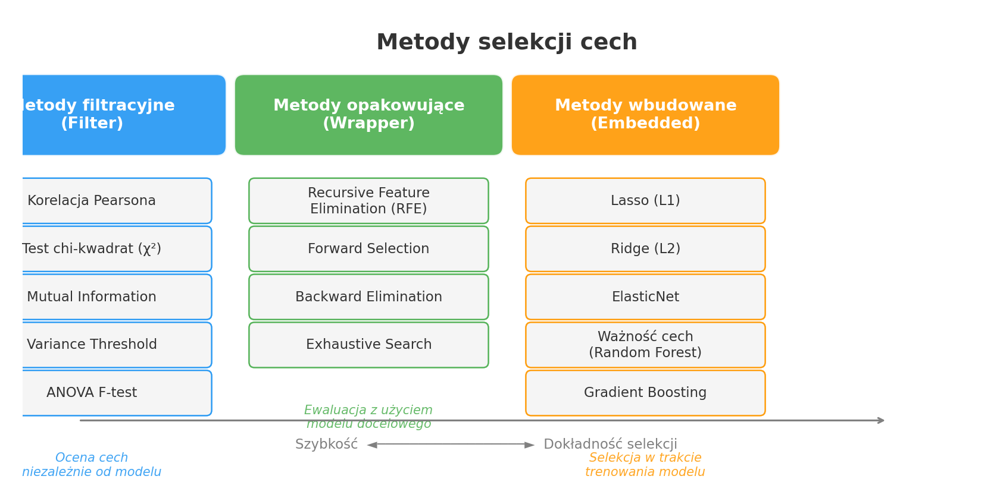
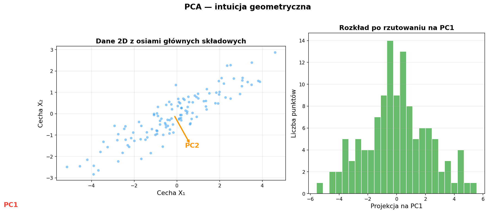

# Laboratorium 2: Redukcja wymiarowości danych

**Zaawansowana Eksploracja Danych**

Tematy:
- Klątwa wymiarowości i motywacja do redukcji cech
- Selekcja cech — metody filtracyjne, opakowujące i wbudowane
- PCA — Analiza Głównych Składowych
- t-SNE i inne metody redukcji nieliniowej
- Praktyczne zastosowania w eksploracji danych

---

## Dlaczego redukcja wymiarowości?

Wraz ze wzrostem liczby cech pojawiają się fundamentalne problemy:

- **Klątwa wymiarowości** — w przestrzeniach wysokowymiarowych odległości między punktami stają się nierozróżnialne, co degraduje działanie algorytmów opartych na metrykach (np. kNN)
- **Overfitting** — zbyt wiele cech przy ograniczonej liczbie obserwacji prowadzi do nadmiernego dopasowania modelu do szumu
- **Koszt obliczeniowy** — czas trenowania rośnie (często wykładniczo) z liczbą wymiarów
- **Wizualizacja** — człowiek potrafi analizować dane jedynie w 2–3 wymiarach; redukcja jest konieczna do eksploracji wizualnej
- **Redundancja** — wiele cech jest silnie skorelowanych i nie wnosi nowej informacji

---

## Selekcja cech

Celem selekcji jest wybranie **podzbioru oryginalnych cech**, który najlepiej reprezentuje dane.

- **Metody filtracyjne (Filter)** — oceniają każdą cechę niezależnie od modelu: korelacja Pearsona, test χ², Mutual Information, Variance Threshold. Szybkie, ale nie uwzględniają interakcji między cechami
- **Metody opakowujące (Wrapper)** — wykorzystują model docelowy do ewaluacji podzbiorów cech: RFE, Forward Selection, Backward Elimination. Dokładniejsze, lecz kosztowne obliczeniowo
- **Metody wbudowane (Embedded)** — selekcja odbywa się w trakcie trenowania modelu: regularyzacja L1 (Lasso), ważność cech w Random Forest i Gradient Boosting. Kompromis między szybkością a jakością
- Wybór metody zależy od **rozmiaru danych**, **typu modelu** i **dostępnego czasu obliczeniowego**

---

## PCA — Analiza głównych składowych

PCA (Principal Component Analysis) to najważniejsza metoda **ekstrakcji cech** w uczeniu maszynowym.

- **Cel** — znaleźć nowe osie (składowe główne), wzdłuż których dane mają **maksymalną wariancję**
- **Matematycznie** — PCA wykonuje dekompozycję macierzy kowariancji na wartości i wektory własne; PC1 to kierunek największej zmienności, PC2 jest do niego ortogonalny itd.
- **Standaryzacja** — przed PCA dane należy zawsze standaryzować (StandardScaler), aby cechy o dużych skalach nie zdominowały analizy
- **Wykres osypiska (scree plot)** — pozwala określić, ile składowych zachować (np. próg 95% wyjaśnionej wariancji)
- **Loadings** — współczynniki wektorów własnych pokazują, które oryginalne cechy mają największy wpływ na daną składową

---

## t-SNE i inne metody nieliniowe

Gdy zależności w danych są **nieliniowe**, PCA nie wystarczy — potrzebne są metody zachowujące lokalną strukturę.

- **t-SNE** (t-distributed Stochastic Neighbor Embedding) — mapuje dane do 2D/3D, zachowując lokalne sąsiedztwa; parametr `perplexity` kontroluje równowagę między strukturą lokalną a globalną (typowo 5–50)
- **UMAP** (Uniform Manifold Approximation) — szybsza alternatywa dla t-SNE, lepiej zachowuje strukturę globalną; dobrze skaluje się na dużych zbiorach danych
- **Isomap** — rozszerza MDS o odległości geodezyjne wzdłuż rozmaitości danych; zakłada, że dane leżą na gładkiej podprzestrzeni
- **Ważne ograniczenia** — t-SNE/UMAP służą głównie do **wizualizacji**, nie do redukcji cech na potrzeby modelowania; wyniki zależą od hiperparametrów i nie są deterministyczne
- W laboratorium porównamy PCA 2D z t-SNE 2D na zbiorze Breast Cancer

---

## Podsumowanie

Kluczowe wnioski z laboratorium:

- **Redukcja wymiarowości** jest niezbędna przy dużej liczbie cech — poprawia generalizację, zmniejsza koszt obliczeń i umożliwia wizualizację
- **Selekcja cech** zachowuje oryginalne cechy (interpretowalność), **ekstrakcja cech** (PCA) tworzy nowe, optymalne osie
- **PCA** — złoty standard redukcji liniowej; wymaga standaryzacji; wybór liczby składowych na podstawie scree plot
- **t-SNE / UMAP** — potężne narzędzia wizualizacji nieliniowej, ale nie nadają się jako etap preprocessingu dla modeli predykcyjnych
- **Eksperymentuj** — porównuj wyniki klasyfikacji na pełnym zbiorze, po PCA i po selekcji cech, aby ocenić rzeczywisty wpływ redukcji
