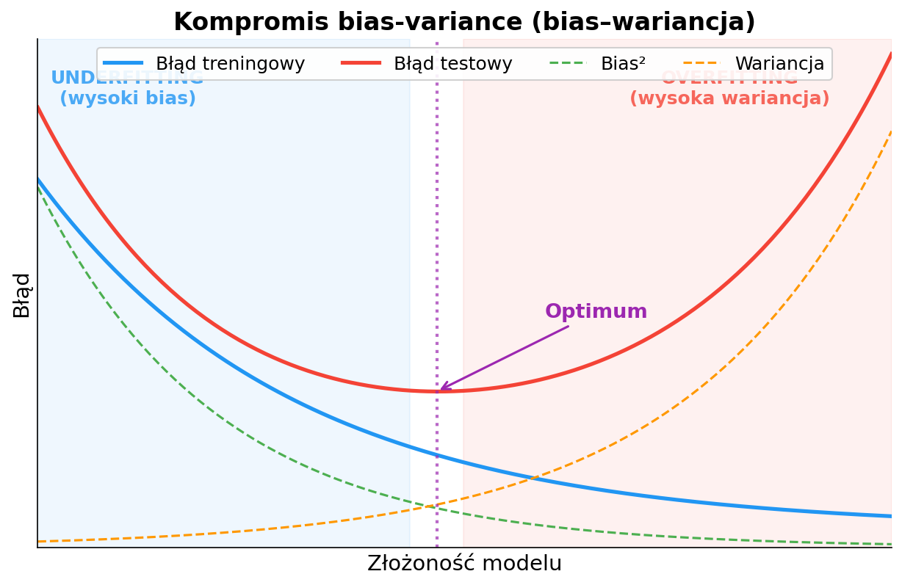
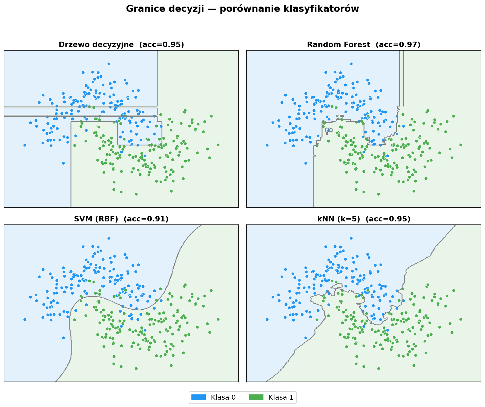
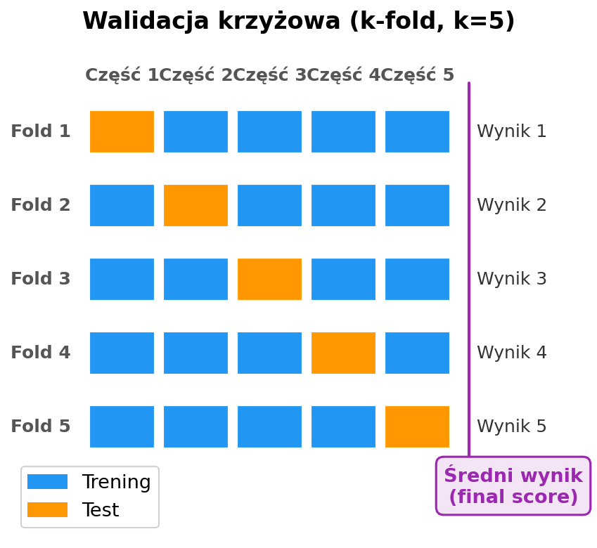

# Laboratorium 3: Klasyfikacja i regresja

**Zaawansowana Eksploracja Danych**

- Uczenie nadzorowane — dwa główne zadania
- Porównanie algorytmów klasyfikacji i regresji
- Ewaluacja modeli i strojenie hiperparametrów

---

## Uczenie nadzorowane — klasyfikacja vs regresja

- **Klasyfikacja** — przewidywanie kategorii (etykiety dyskretnej), np. diagnoza choroby, rozpoznawanie spamu
- **Regresja** — przewidywanie wartości ciągłej, np. cena nieruchomości, temperatura
- Wybór zadania zależy od **typu zmiennej docelowej**: jakościowa → klasyfikacja, ilościowa → regresja
- W obu przypadkach model uczy się na danych z etykietami (zbiór treningowy) i jest oceniany na danych niewidzianych (zbiór testowy)
- Kluczowe wyzwanie: model powinien dobrze **generalizować**, a nie jedynie zapamiętać dane treningowe

---

## Kompromis bias-variance

- **Bias (obciążenie)** — błąd wynikający z uproszczonych założeń modelu; wysoki bias → underfitting
- **Wariancja** — wrażliwość modelu na losowe fluktuacje w danych treningowych; wysoka wariancja → overfitting
- **Underfitting** — model zbyt prosty, nie wychwytuje struktury danych (np. regresja liniowa dla danych nieliniowych)
- **Overfitting** — model zbyt złożony, dopasowuje się do szumu (np. bardzo głębokie drzewo decyzyjne)
- Celem jest znalezienie **optymalnej złożoności**, minimalizującej łączny błąd testowy

---

## Przegląd klasyfikatorów

- **Drzewo decyzyjne** — proste reguły podziału; łatwe do interpretacji, ale podatne na overfitting
- **Random Forest** — zespół drzew (bagging); redukuje wariancję, odporny na przeuczenie
- **SVM (RBF)** — szuka optymalnej hiperpłaszczyzny rozdzielającej klasy; skuteczny w wysokich wymiarach
- **kNN** — klasyfikuje na podstawie k najbliższych sąsiadów; prosty, ale wrażliwy na skalę cech i wymiarowość

---

## Ewaluacja modeli

- **Walidacja krzyżowa (k-fold)** — dane dzielone na k części; każda służy raz jako zbiór testowy, co daje stabilniejszą ocenę
- **Accuracy** — odsetek poprawnych predykcji; może być mylące przy niezbalansowanych klasach
- **Precision / Recall** — precyzja (ile z przewidzianych pozytywnych jest poprawnych) vs czułość (ile pozytywnych przypadków wykryto)
- **F1-score** — średnia harmoniczna precision i recall; kompromis między nimi
- **ROC AUC** — pole pod krzywą ROC; miara jakości rankingu predykcji niezależna od progu decyzyjnego

---

## Podsumowanie

- Uczenie nadzorowane dzieli się na **klasyfikację** (zmienna dyskretna) i **regresję** (zmienna ciągła)
- Kompromis bias-variance to fundament doboru złożoności modelu
- Nie istnieje jeden „najlepszy" algorytm — wybór zależy od danych i problemu (**No Free Lunch Theorem**)
- Strojenie hiperparametrów (`GridSearchCV`) i walidacja krzyżowa są niezbędne do rzetelnej oceny
- W laboratorium porównamy klasyfikatory na zbiorze Heart Disease i modele regresji na California Housing
