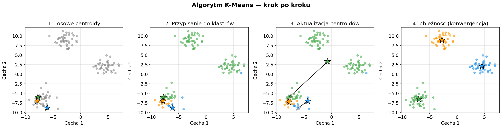
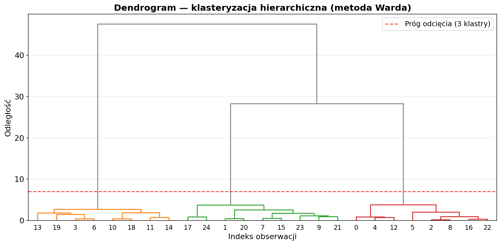
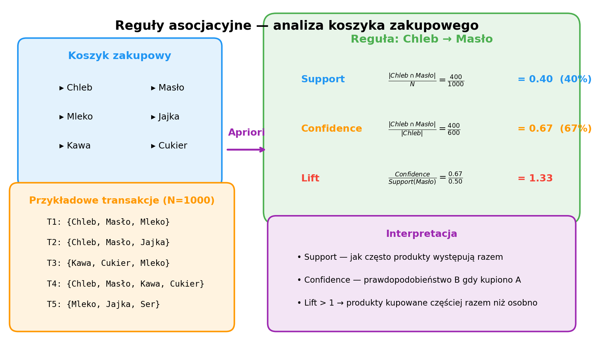

# Laboratorium 4: Analiza skupień i reguły asocjacyjne

**Zaawansowana Eksploracja Danych**

---

## Uczenie nienadzorowane — po co grupować dane?

- **Uczenie nienadzorowane** to odkrywanie ukrytych struktur w danych *bez etykiet* — algorytm sam znajduje wzorce
- **Klasteryzacja** — podział obserwacji na grupy o podobnych cechach, np. segmentacja klientów na podstawie zachowań zakupowych
- **Reguły asocjacyjne** — identyfikacja zależności między elementami, np. „kto kupuje chleb, często kupuje też masło"
- Zastosowania praktyczne: systemy rekomendacji, wykrywanie anomalii, analiza koszyka zakupowego, grupowanie dokumentów
- Kluczowe pytanie: **ile klastrów wybrać?** — metoda łokcia (*Elbow Method*) i *Silhouette Score*

---

## K-Means krok po kroku

- **Krok 1:** Losowy wybór *k* centroidów (środków klastrów)
- **Krok 2:** Przypisanie każdego punktu do najbliższego centroidu (odległość euklidesowa)
- **Krok 3:** Przeliczenie centroidów jako średnia punktów w klastrze
- **Krok 4:** Powtarzanie kroków 2–3 aż do zbieżności (centroidy przestają się zmieniać)
- Parametr *k* ustalamy z góry — optymalną wartość dobieramy za pomocą **metody łokcia** (minimalizacja inercji) lub **Silhouette Score**

---

## Klasteryzacja hierarchiczna i DBSCAN

- **Klasteryzacja hierarchiczna** — buduje drzewo (dendrogram) łączeń; nie wymaga ustalenia *k* z góry, liczbę klastrów określamy przez próg odcięcia
- **Metoda Warda** — minimalizuje wariancję wewnątrz klastrów, najczęściej stosowana w praktyce
- **DBSCAN** — wykrywa klastry o dowolnym kształcie; sam określa liczbę klastrów, potrafi oznaczać punkty odstające (*outliers*) jako szum
- Kluczowe parametry DBSCAN: `eps` (promień sąsiedztwa) i `min_samples` (minimalna gęstość)
- **Porównanie:** K-Means → sfery, hierarchiczny → drzewo, DBSCAN → dowolne kształty + detekcja szumu

---

## Reguły asocjacyjne — analiza koszyka zakupowego

- **Algorytm Apriori** — wyszukuje *częste zbiory elementów* (itemsets) i generuje reguły postaci A → B
- **Support** — jak często dany zbiór występuje w transakcjach (miara popularności)
- **Confidence** — prawdopodobieństwo zakupu B, gdy kupiono A (miara pewności reguły)
- **Lift > 1** oznacza, że produkty są kupowane razem *częściej* niż wynikałoby z przypadku
- Praktyczne zastosowanie: układ produktów na półkach, kampanie cross-sellingowe, personalizacja ofert

---

## Podsumowanie

- Poznaliśmy trzy algorytmy klasteryzacji: **K-Means**, **hierarchiczny** i **DBSCAN** — każdy ma inne zalety i ograniczenia
- **K-Means** jest szybki i intuicyjny, ale wymaga podania *k* i zakłada sferyczne klastry
- **DBSCAN** świetnie radzi sobie z danymi o nieregularnych kształtach i automatycznie wykrywa szum
- **Reguły asocjacyjne** (Apriori) pozwalają odkrywać ukryte zależności między produktami w danych transakcyjnych
- Na dzisiejszym laboratorium: segmentacja klientów (K-Means, DBSCAN, hierarchiczny) + analiza koszyka zakupowego (Apriori z biblioteką `mlxtend`)
