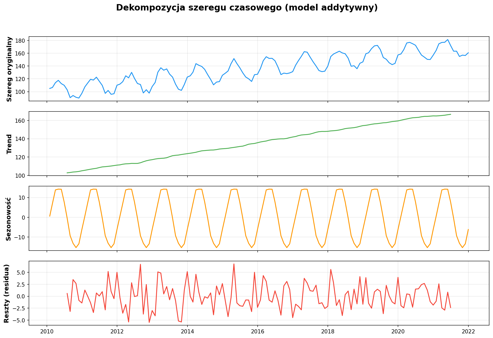
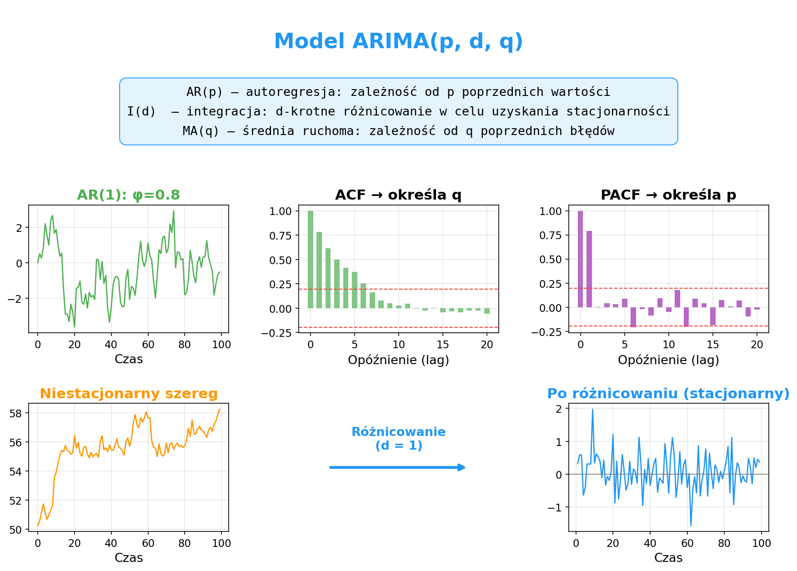
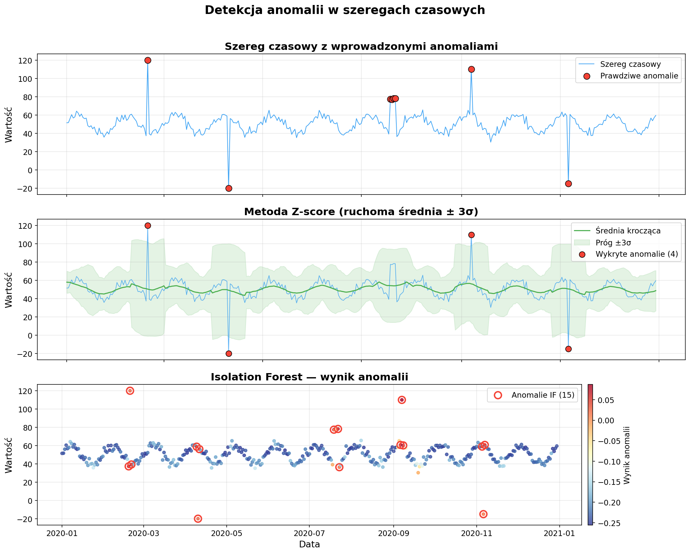

# Laboratorium 5: Szeregi czasowe i detekcja anomalii

### Zaawansowana Eksploracja Danych

---

## Szeregi czasowe — gdzie spotykamy je na co dzień?

- **Finanse** — kursy walut, ceny akcji, wolumen transakcji
- **IoT i przemysł** — odczyty z czujników, zużycie energii, monitoring maszyn
- **Pogoda i klimat** — temperatura, opady, stężenie CO₂
- **Web i IT** — ruch sieciowy, liczba zapytań do serwera, metryki aplikacji

### Kluczowe właściwości szeregów czasowych

- **Trend** — długoterminowy kierunek zmian (wzrost lub spadek)
- **Sezonowość** — regularne, powtarzające się wzorce (np. cykl roczny, tygodniowy)
- **Stacjonarność** — stała średnia i wariancja w czasie (wymagana przez większość modeli)

---

## Dekompozycja szeregu czasowego

- **Model addytywny**: Y(t) = Trend + Sezonowość + Reszty — gdy amplituda sezonowości jest stała
- **Model multiplikatywny**: Y(t) = Trend × Sezonowość × Reszty — gdy amplituda rośnie z trendem
- Dekompozycja pozwala oddzielnie analizować każdą składową
- Reszty (residua) powinny przypominać biały szum — ich wzorce sygnalizują niedopasowanie modelu
- Narzędzie: `seasonal_decompose` z biblioteki `statsmodels`

---

## Modelowanie ARIMA

- **AR(p)** — autoregresja: wartość zależy od *p* poprzednich obserwacji (parametr odczytujemy z PACF)
- **I(d)** — integracja: *d*-krotne różnicowanie usuwające trend i przywracające stacjonarność
- **MA(q)** — średnia ruchoma błędów: wartość zależy od *q* poprzednich błędów (parametr odczytujemy z ACF)
- **SARIMA** rozszerza ARIMA o sezonowe składniki (P, D, Q, s) dla danych z cyklicznością
- Stacjonarność weryfikujemy testem ADF (Augmented Dickey-Fuller)

---

## Detekcja anomalii

- **Z-score / ruchoma średnia ± kσ** — szybka metoda statystyczna, wymaga dobrania okna i progu
- **IQR (rozstęp międzykwartylowy)** — odporna na wartości odstające, dobra dla rozkładów skośnych
- **Isolation Forest** — algorytm drzewiasty izolujący anomalie mniejszą liczbą podziałów
- **LOF (Local Outlier Factor)** — porównuje lokalną gęstość punktu z jego sąsiadami
- W szeregach czasowych budujemy cechy (wartość, gradient, średnia krocząca) przed zastosowaniem metod ML

---

## Podsumowanie

- Szeregi czasowe wymagają **dekompozycji** na trend, sezonowość i reszty przed modelowaniem
- Model **ARIMA/SARIMA** to klasyczne podejście do prognozowania — dobieramy parametry na podstawie ACF/PACF
- **Stacjonarność** jest kluczowym wymaganiem — weryfikujemy ją testem ADF i stosujemy różnicowanie
- Do **detekcji anomalii** dobieramy metodę do kontekstu: statystyczne (Z-score) vs. ML (Isolation Forest, LOF)
- Na laboratorium przećwiczymy pełny pipeline: dekompozycja → prognozowanie → wykrywanie anomalii
