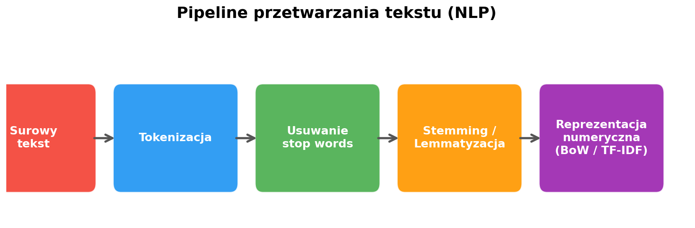
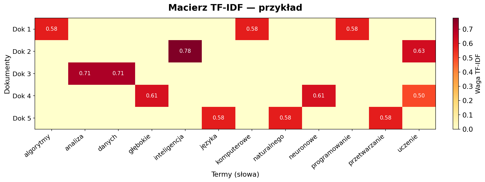
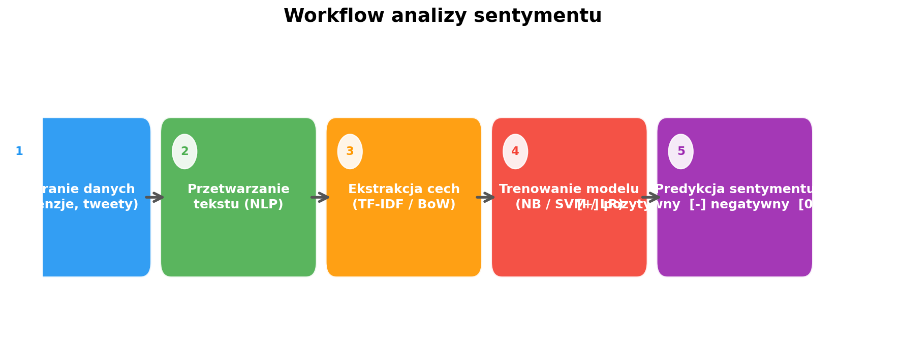

# Laboratorium 6: Eksploracja tekstu i analiza sentymentu

**Zaawansowana Eksploracja Danych**

- Przetwarzanie języka naturalnego (NLP)
- Reprezentacja tekstu: Bag of Words, TF-IDF
- Klasyfikacja tekstu i analiza sentymentu
- Systemy rekomendacyjne oparte na treści

---

## Tekst jako dane — wyzwania NLP

- **Tekst jest nieustrukturyzowany** — brak kolumn, typów, schematów; każdy dokument ma inną długość i formę
- **Wieloznaczność języka** — to samo słowo może mieć różne znaczenia w różnym kontekście (np. „zamek" — budowla vs mechanizm)
- **Wysoka wymiarowość** — słownik typowego korpusu to dziesiątki tysięcy unikalnych słów
- **Szum i zmienność** — literówki, slang, skróty, różne style pisania
- Zastosowania NLP: klasyfikacja dokumentów, filtrowanie spamu, analiza opinii, chatboty, tłumaczenie maszynowe

---

## Pipeline przetwarzania tekstu

- **Surowy tekst** → zamiana na małe litery, usunięcie znaków specjalnych i liczb
- **Tokenizacja** — podział tekstu na pojedyncze słowa (tokeny)
- **Usuwanie stop words** — eliminacja częstych słów bez wartości informacyjnej (np. „i", „the", „a")
- **Stemming / Lemmatyzacja** — sprowadzenie słów do formy bazowej (np. „running" → „run")
- **Reprezentacja numeryczna** — przekształcenie tekstu w wektor liczb (BoW, TF-IDF)

---

## Reprezentacja tekstu — Bag of Words i TF-IDF

- **Bag of Words (BoW)** — zlicza wystąpienia każdego słowa w dokumencie; prosta, ale nie uwzględnia ważności słów
- **TF-IDF (Term Frequency – Inverse Document Frequency)** — waży słowa: częste w dokumencie ale rzadkie w korpusie otrzymują wyższą wagę
- TF-IDF redukuje wpływ słów powszechnych i wydobywa słowa charakterystyczne dla dokumentu
- W scikit-learn: `CountVectorizer` (BoW) i `TfidfVectorizer` (TF-IDF) z parametrami `max_features`, `min_df`, `max_df`

---

## Analiza sentymentu i klasyfikacja tekstu

- **Podejście nadzorowane** — trenujemy klasyfikator (Naive Bayes, SVM, Logistic Regression) na etykietowanych danych
- **Podejście leksykalne** — korzystamy z gotowych słowników sentymentu (np. VADER, TextBlob) bez trenowania
- Typowe metryki: accuracy, precision, recall, F1-score, macierz pomyłek
- Zastosowania: analiza opinii klientów, monitoring marki, klasyfikacja recenzji, filtrowanie spamu
- Na laboratorium: porównanie minimum 2 modeli na zbiorze recenzji filmowych

---

## Podsumowanie

- NLP umożliwia maszynowe przetwarzanie i rozumienie tekstu — kluczowy pipeline: tokenizacja → czyszczenie → wektoryzacja
- **TF-IDF** to skuteczna i prosta metoda reprezentacji tekstu — lepsza niż surowe zliczenia (BoW)
- Analiza sentymentu pozwala automatycznie klasyfikować opinie jako pozytywne, negatywne lub neutralne
- Podobieństwo kosinusowe na wektorach TF-IDF pozwala budować systemy rekomendacyjne oparte na treści
- Dziś na laboratorium: pełny pipeline NLP, klasyfikacja 20 Newsgroups, analiza sentymentu recenzji, rekomendacje filmów
